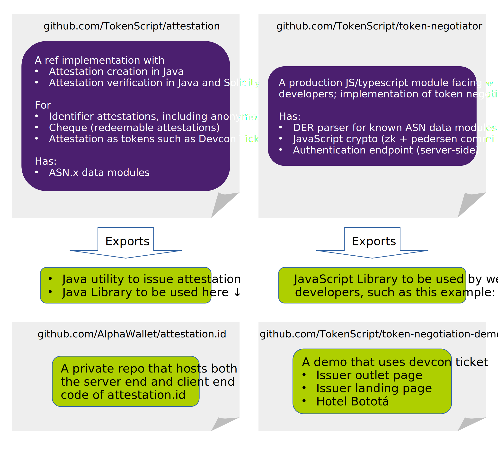

# TokenScript - Attestation

This repository host the attestation libraries as part of TokenScript. Discussion goes to the forum https://community.tokenscript.org/

You can always use this project in your own code through Maven central, by adding the following dependency in your POM:
 ```dtd
 <dependency>
   <groupId>org.tokenscript</groupId>
   <artifactId>attestation</artifactId>
   <version>0.4</version>
 </dependency>
```

This repository's library serves 3 use-cases of attestations.

| Use-case               | Description                                                  | Protocol                                                     | Cmd Demo                         |
| ---------------------- | ------------------------------------------------------------ | ------------------------------------------------------------ | -------------------------------- |
| Identifier attestation | Identifies a person by their Internet identifier such as Twitter Handle and email address. | See below                                                    |                                  |
| Cheque                 | Cheque: a signed message allows the beneficiary to perform an action, such as withdrawing Ether. | [Send-token-by-identifier](http://tokenscript.org/Cheque/send_token_by_identifier.html) | [demo](cli-attestation-demo.md). |
| Attestation as token   | An attestation that can be used as a non-fungible token.     |                                                              |                                  |


## How is the code organised?

The code is not compartmentalised by use-cases, since they share common components. We provide the common components as library, then, for each use-case, a commandline utility.

Since in most cases these attestations are used on the web, Web-developers should be more interested in attestations being implemented as part of token-neogotiation instead of the basic commandline form. Therefore, **this repository should be more of interest by the protocol developers**. Our JavaScript based token negotiation implementation is at the [token-negotiator repo](https://github.com/TokenScript/token-negotiator).

Together with repos that uses the library code, in total we maintain 4 repos. The relationship between these 4 repos are demonstrated here. This one is the first (the upper-left one).



## Build

You need the following installed:

- JDK (version 11 or higher)
- Gradle (version 7.1.1 is used by our devs)
- node.js (version 15 is used by our devs)

Once you have them installed, run:

    $ gradle build

The build script will run a few tests, resulting a few pem files created in `build/test-results/` directory.

## Try it yourself

To create a jar file for running the demo, run:

    $ gradle shadowJar

Which will create a jar file that you can run in the commandline

    build/libs/attestation-all.jar

There is a walk-through to use the functionalities provided by this library through commandline: [commandline cheque demonstration](cli-attestation-demo.md) and the  [commandline EIP712 attestation demonstration](cli-cheque-demo.md)

## Organisation of this repo

This repository has the following content:

data-modules
:the data modules definitions used in this project

src
:the implementation of the attestation and protocols. We use a Java-Solidity model for quick prototyping - testing.

ethereum/lib
: lib for smart contracts which uses attestations

ethereum/issuers
: example smart contracts used by issuers, for example, revocation list management.

ethereum/trustlist
: members of trustlists to be adopted by smart contracts

ethereum/experiments
: work not in the published specifications

ethereum/example-james-squire
: an example to be used in your projects which requires attestations

paper
: the paper behind the design of this project. The current version there is dated (2018) and doesn't reflect the new work in the last a few years. The current focus is the [cheque/attestation protocol](http://tokenscript.org/Cheque/send_token_by_identifier.html)


# ERC publications

ERC's related to this stream of work are:

[ERC1386](https://github.com/ethereum/EIPs/issues/1386), [ERC1387](https://github.com/ethereum/EIPs/issues/1387) & [ERC1388](https://github.com/ethereum/EIPs/issues/1388)

